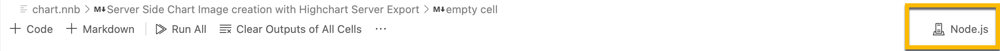

# Visual Studio Code Notebook Samples

I created these samples to accompany a talk at the 2022 Cascadia JS Confernce in Bend Oregon.

I am using the Node.js Code Notebook extension for this.  

## Setup for Node.js Code Notebook

Visit this page in the Visual Studio marketplace to get a full understanding of the Node.js Notebook extension: https://marketplace.visualstudio.com/items?itemName=donjayamanne.typescript-notebook

√ Install Node.js version >= 12.   
√ Node.js should be in your current path.  
√ Install the Node.js extension.  I also installed the Jupyter extensions as they give you some extra tools to run code.  
√ Create a file with the extension nnb.  
√ Select your Node.js kernel. This can be done in a clickable area at the right of an opened nnb file.  
  

You'll find 2 types of cells: Markdown and Code.  Markdown cells will accept markdown and html.  Code will be runnable per the type of notebook 
as determined by the file extension.